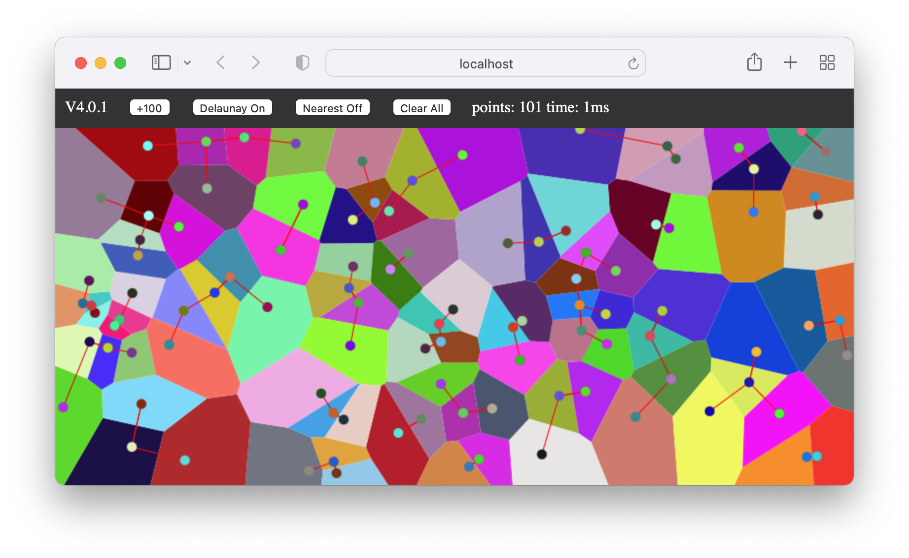

# InteractiveVoronoi

交互式Voronoi图与最邻近点查找.

Interactive Voronoi diagram and nearest point finding.

此代码是为了课程”高级算法设计“而写的，请勿将此代码用于任何作业提交。

This code was written for the course "Advanced Algorithm Design", please do not use this code for any assignment submission.

我们建议您直接访问以下网页以使用本程序.

We recommend that you visit the following pages directly to use this program.

https://interactivevoronoi-0dwh26cfbd6bd-1253139667.tcloudbaseapp.com/

本程序极易使用。点击空白处以添加新点。拖动点以改变其位置。

This program is extremely easy to use. Click on a blank space to add a new point. Drag the point to change its position.

为了运行本程序，您需要一台拥有鼠标的设备，并且搭载支持Html5 canvas 标签的浏览器。请注意，本程序没有为移动设备而优化。

In order to run this program, you need a device with a mouse and a browser that supports Html5 canvas tags, and then just open the Html file. Please note that this application is not optimized for mobile devices.